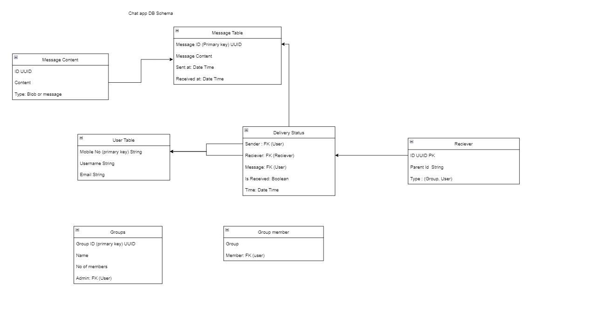
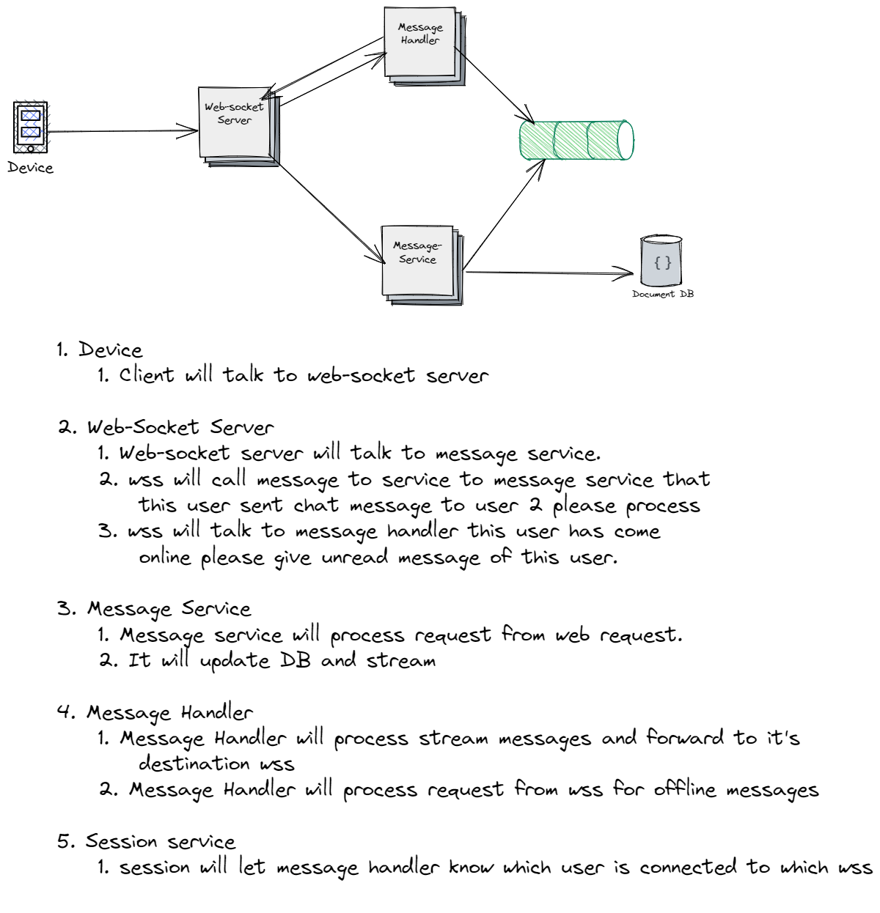

# chat-app

## Simple Chat application, where user can chat one-to-one, one-to-many or can share file. built to get hands on technologies and to improve skills.

Functional Requirements
1. One-to-one chat
2. One-to-many chat
3. File share
4. Delivery Status
5. Online status

Non-Functional Requirements
1. Low latency
2. High availability


DB Schema




High Level Diagram



API's

1. POST: /api/v1/message/send/isGroup

request body:
```
{
    "message": "Test message 4",
    "type": "MESSAGE",
    "sentDateTime": "13/08/2022+19:38",
    "senderId": "1",
    "receiverId": "2"
}
```

2. POST: /api/v1/create/group
```
{
    "groupName": "name",
    "admin": "userid",
    "createdat": "datetime" 
}
```

3. PUT: /api/v1/group/add/{user}

4. GET: /api/v1/messages/{user}